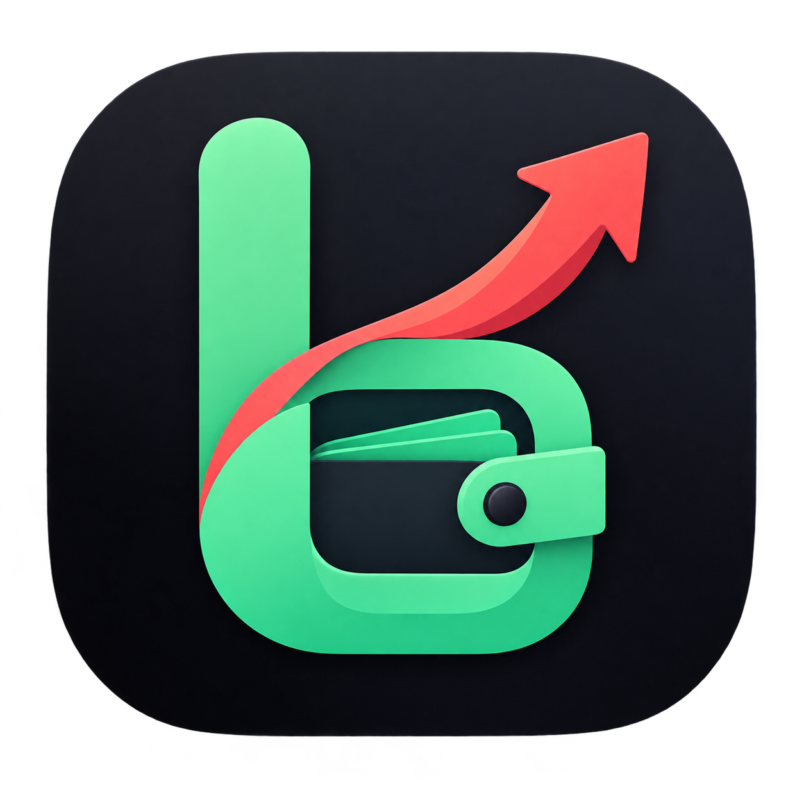

<div align="center">
  
  
  # BareBudget
  
  **Frictionless Personal Finance & Survival Runway Tracker**
  
  *Kelola keuangan bulanan, hitung tanggal bertahan hidup finansialmu (Runway/Death Day), kelola multi-dompet, dan capai target tabungan.*

  ---

  [](https://kotlinlang.org/)
  [](https://developer.android.com/jetpack/compose)
  [](https://m3.material.io/)
  [](https://gofiber.io/)
  [](https://www.postgresql.org/)
  [](https://developer.android.com/training/data-storage/room)
  [](https://firebase.google.com/)

</div>

---

## 📖 Tentang BareBudget

**BareBudget** adalah aplikasi personal finance minimalis, cepat, dan modern yang dirancang untuk menjawab pertanyaan krusial di tengah bulan:
> *"Dengan gaya hidup belanja saat ini, sampai tanggal berapa sisa uangku bisa bertahan hidup?"*

Seluruh antarmuka aplikasi dibangun **100% menggunakan Material Design 3 (M3)** dengan Jetpack Compose, menghasilkan visual yang konsisten, modern, adaptif, serta mendukung penuh personalisasi tema dinamis (*Material You*).

Dengan arsitektur **Offline-First**, BareBudget dapat langsung digunakan seketika tanpa login (**Guest Mode**) dan dapat ditautkan ke **Google Cloud Account** kapan saja untuk sinkronisasi tanpa kehilangan data historis.

---

## ✨ Fitur Unggulan

### 1. 🧮 Financial Runway & "Estimated Death Day"
* Menghitung kecepatan pengeluaran harian (*burn rate*).
* Memprediksi tanggal persis kapan saldo budget Anda akan habis di bulan berjalan.
* Memberikan indikator status kesehatan keuangan secara real-time (*Aman*, *Waspada*, atau *Kritis*).

### 2. 👛 Multi-Wallet & Arus Kas Lengkap
* Lacak transaksi harian dengan kategori lengkap: **Pemasukan (Income)**, **Pengeluaran (Expense)**, dan **Transfer Antar Dompet**.
* Kelola berbagai rekening dan e-wallet (Tunai, BCA, Mandiri, GoPay, OVO, ShopeePay, dll).
* Kalkulasi total kekayaan bersih (**Net Worth**) otomatis dari akumulasi seluruh saldo aktif.

### 3. 🎨 100% Material Design 3 UI & Dynamic Theming
* Dibangun secara native dengan komponen standar **Material 3 (M3)**: *M3 Navigation Bar, M3 Floating Action Button, M3 Cards, dan M3 Dialogs*.
* **Dynamic Color (Material You)**: Warna antarmuka dapat otomatis beradaptasi dengan warna wallpaper sistem pada Android 12+.
* **Brand Theme & Dark Mode**: Pilihan tema *Coral Red* khas BareBudget dan dukungan penuh mode Terang / Gelap (*Light/Dark/System Default*).

### 4. 🚀 Animated Splash Screen & Illustrated Onboarding
* **Branded Splash Screen**: Transisi *fade & spring scale* yang mulus serta dukungan penuh *Android 12+ SplashScreen API*.
* **3D Vector Illustrated Onboarding**: Alur pengenalan aplikasi interaktif dengan ilustrasi *semi-3D cartoonish* yang modern dan ramah pengguna.

### 5. 🎯 Savings Goals & Pockets (Sinking Funds)
* Buat pos target tabungan (Dana Darurat, Liburan, Gadget, Kendaraan, dll).
* Visualisasi progress bar interaktif dengan persentase dan estimasi sisa dana yang dibutuhkan.
* Dialog fleksibel untuk **Setor Tabungan (Deposit)** maupun **Tarik Dana (Withdraw)**.

### 6. 🔁 Due Bills & Recurring Subscriptions
* Catat dan pantau pengingat tagihan berkala (WiFi, Kos, Listrik, Streaming, PayLater).
* **Auto-Rollover**: Ketika tagihan ditandai **Lunas (PAID)**, sistem otomatis menjadwalkan tagihan untuk periode berikutnya (*Weekly, Monthly, Yearly*).

### 7. 👥 Smart Split Bill Calculator
* Kalkulator patungan cerdas langsung di dalam aplikasi.
* Hitung pembagian rata (*Equal Split*) lengkap dengan opsi penyesuaian pajak restoran (PB1 10%) dan service charge (5%).
* **1-Click Share to WhatsApp**: Rincian tagihan siap kirim langsung ke teman atau grup pesan singkat.

### 8. 📊 Financial Analytics & Visual Breakdown
* Grafik perbandingan arus kas pemasukan vs pengeluaran.
* Distribusi pengeluaran per kategori untuk evaluasi pos pengeluaran bulanan.

### 9. 🔒 Offline-First Architecture & Cloud Sync
* Seluruh fitur bekerja 100% secara offline menggunakan **Room SQLite Database**.
* Sinkronisasi dua arah (*Two-Way Sync*) dengan backend REST API Go saat terkoneksi internet.
* **Guest to Google Migration**: Mulai instan sebagai *Guest*, migrasikan seluruh data lokal ke Google Account saat login.

---

## 🏛️ Arsitektur & Tech Stack

```
BareBudget/
├── app/                        # Android Native Client (Kotlin + Jetpack Compose)
│   ├── src/main/java/com/ssajudn/barebudget/
│   │   ├── data/
│   │   │   ├── auth/           # Firebase Authentication & Credential Manager
│   │   │   ├── local/          # Room DB (Entities, DAOs) & ThemePreferences
│   │   │   ├── model/          # DTOs & Domain Models
│   │   │   ├── network/        # Retrofit Client & ApiService
│   │   │   └── repository/     # Offline-First BudgetRepository
│   │   ├── ui/
│   │   │   ├── analytics/      # Financial Breakdown & Category Charts
│   │   │   ├── bills/          # Due Bills & Recurring Subscriptions
│   │   │   ├── budget/         # Monthly Spending Target Setup
│   │   │   ├── components/     # M3 Dialogs, AppNavigationBar, M3 Settings
│   │   │   ├── dashboard/      # Financial Runway Card & Recent Feeds
│   │   │   ├── goals/          # Savings Goals & Pockets
│   │   │   ├── navigation/     # AppNavigation & Screen Routes
│   │   │   ├── onboarding/     # 3D Illustrated Onboarding & Auth Screens
│   │   │   ├── settings/       # Appearance (Material You), Sync & Profile
│   │   │   ├── splash/         # Animated Branded Splash Screen
│   │   │   ├── theme/          # Material 3 Color Schemes, Typography & Shapes
│   │   │   ├── transaction/    # Add Expense, Detail & Split Bill BottomSheet
│   │   │   └── wallets/        # Multi-Wallet Management
│   │   └── utils/              # CurrencyFormatter, DateUtils, AppConfig
│   └── build.gradle.kts
│
└── server/                     # High-Performance REST API (Go + Fiber)
    ├── cmd/api/main.go         # Server entrypoint & Route Handlers
    ├── internal/
    │   ├── config/             # Environment configurations
    │   ├── database/           # PostgreSQL connection & GORM AutoMigrate
    │   ├── handler/            # HTTP Request Handlers
    │   ├── middleware/         # Auth & Header Middlewares
    │   ├── models/             # Database Models & Entities
    │   ├── repository/         # Database Queries & GORM Operations
    │   └── service/            # Business Logic & Runway Calculations
    └── go.mod
```

---

## 🚀 Panduan Menjalankan Project

### 1. Menjalankan Backend Server (Go + PostgreSQL)

Pastikan Anda telah menginstal **Go (1.23+)** dan **PostgreSQL**.

```bash
# Masuk ke direktori server
cd server

# Salin konfigurasi environment
cp .env.example .env

# Jalankan server API (default port: 8080)
go run cmd/api/main.go
```

> **Tips Docker**: Anda juga dapat menjalankan database PostgreSQL menggunakan Docker:
> ```bash
> docker run --name barebudget-postgres -e POSTGRES_USER=postgres -e POSTGRES_PASSWORD=postgres -e POSTGRES_DB=barebudget -p 5432:5432 -d postgres:16-alpine
> ```

---

### 2. Menjalankan Aplikasi Android

1. Buka root folder project di **Android Studio**.
2. Pastikan file `google-services.json` Anda telah berada di direktori `app/` untuk Firebase Auth.
3. Jalankan emulator Android atau hubungkan perangkat fisik.
4. Klik **Run 'app'** (`Shift + F10`) atau compile melalui CLI:

```bash
./gradlew installDebug
```

---

## 🎨 Material 3 Design System

BareBudget menerapkan panduan desain **Material Design 3 (M3)** secara menyeluruh:
* **`M3 Dynamic Theming`**: Menggunakan palet warna tonal adaptif (*Tonal Spot / Dynamic Colors*) yang mengikuti palet Material You Android 12+.
* **`M3 Navigation Bar`**: Navigasi bottom bar resmi Material 3 dengan *pill indicator* aktif dan transisi halus.
* **`M3 Elevated & Outlined Cards`**: Pengelompokan informasi keuangan dengan hirarki elevasi permukaan yang jelas.
* **`M3 Expressive Typography & Shapes`**: Bentuk sudut membulat ekspresif (*extra large shapes*) yang ergonomis untuk perangkat mobile.

---

## 📄 Lisensi

Distributed under the **MIT License**. Lihat `LICENSE` untuk informasi lebih lanjut.

<div align="center">
  <sub>Dibangun dengan ❤️ oleh <a href="https://github.com/Udean777">Udean777</a> untuk kebebasan finansial yang lebih sehat.</sub>
</div>
